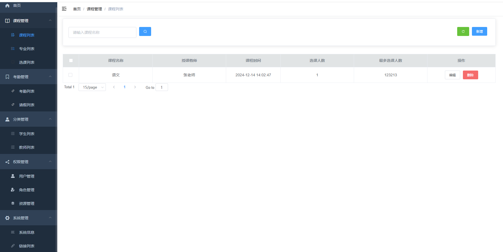

# 学生考勤管理系统后台管理模块
```简要描述
①　课程管理：管理员对课程的详情信息进行管理。
②　专业管理：管理员对专业的详情信息进行管理。 
③　选课管理：管理员对选课的详情信息进行管理。 
④　考勤管理：管理员对考勤的详情信息进行管理。 
⑤　请假管理：当学生请假有误时，可联系管理员对学生的请假信息进行管理。 
⑥　签到打卡：由教师发布签到信息，学生收到签到信息后进行打卡签到。 
⑦　统计报表：管理员可下载每周学生的考勤情况统计报表。 
⑧　权限控制：对前后台的访问权限进行控制，使用RABC 模型。
```
# 主要页面
## 登录页面


## 后台



## Build Setup

```bash
# install dependency
npm install

# develop
npm run dev
```
